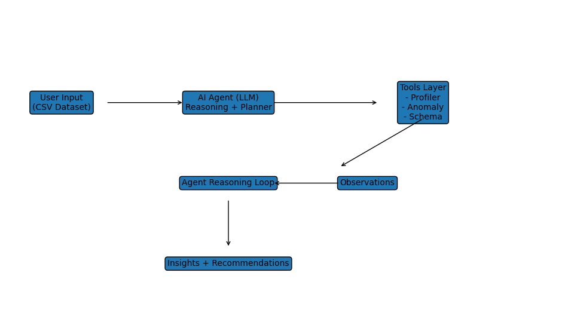

# 🤖 AI Data Quality Agent – Agentic Data Observability System

End-to-end AI Product demo: from dataset ingestion → agent reasoning → tool execution → insights → recommendations.

AI Data Quality Agent is an **agentic AI system** that autonomously detects data quality issues using LLMs + tool orchestration.

---

## 🚀 Key Features

* Agent-driven dataset analysis
* Dynamic tool selection
* Iterative reasoning loop
* AI-generated insights
* Streamlit UI

---

## 🧠 What Makes This Different

Traditional systems:

* Static pipelines
* Predefined rules

This system:

> Uses an AI agent that **decides what to do next**

---

## 🤖 Agentic Architecture

The system uses a **LangChain agent** that:

* selects tools dynamically
* executes validation checks
* observes outputs
* iterates reasoning

---
## 📐 Architecture


___

## 🔄 High-Level Flow

```text
User Input
   ↓
AI Agent (LLM reasoning loop)
   ↓
Tools:
   - Data profiler
   - Anomaly detector
   - Schema validator
   ↓
Observations
   ↓
Agent reasoning
   ↓
Insights + Recommendations
```

---

## 🧪 Example

**Input:** CSV dataset

**Agent reasoning:**

1. Check missing values
2. Detect outliers
3. Validate schema

**Output:**

* Issues detected
* Root cause explanation
* Suggested fixes

---

## 📊 KPIs

| KPI                 | Target |
|---------------------|--------|
| Detection Accuracy  | >85%   |
| Insight Relevance   | >4/5   |
| Iterations per task | ≥2     |

---

## 📂 Project Structure

```
ai-data-quality-agent/
│
├── app.py
├── requirements.txt
│
├── data/
│
├── src/
│   ├── tools/
│   │   ├── profiler.py
│   │   ├── anomaly.py
│   │   └── schema.py
│   │
│   ├── agent/
│   │   └── agent_executor.py
│   │
│   └── utils/
│
├── prompts/
│
├── docs/
│   ├── PRD.md
│   └── architecture.png
│
└── README.md
```

---

## 🛠️ Tech Stack

* Python
* Pandas
* LangChain (Agents + Tools)
* OpenAI API
* Streamlit

---

## ⚙️ Run Locally

```bash
pip install -r requirements.txt
streamlit run app.py
```

---

## 🔭 Product Vision
This project is the first step toward building an AI-native data observability platform powered by autonomous agents. It demonstrates the shift:

> Data Tools → AI Copilots → Autonomous Agents

Future:

* Self-healing pipelines
* Real-time observability
* AI-native data platforms

---

## 👤 Author

Vedika Gupta
AI Product Manager | Data Platforms → AI Platforms

---

## ⭐️ Why This Project Matters

Most AI demos stop at LLM outputs.

This project demonstrates:

* agentic workflows
* system thinking
* product design

Which are critical for modern AI platforms.
